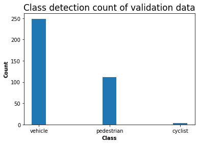

### Project overview

This section should contain a brief description of the project and what we are trying to achieve. Why is object detection such an important component of self driving car systems?

The goal of this project is predicting the vehicle, pedestrian, cyclist, from recorded image of front camera of car. The object detection using  the optical camera is most prospective way to make the car drive itself because sensor price is cheap than [LiDAR](https://velodynelidar.com/what-is-lidar/) sensor.

### Set up

This section should contain a brief description of the steps to follow to run the code for this repository.

Specially, the Deep Learning technology is used for the object detection. To implement that method, I first build the the [Convolutional Neural Network](https://en.wikipedia.org/wiki/Convolutional_neural_network) model. Second, large collection dataset is needed to train and validate the built model. In this project, I use  the Perception dataset of [Waymo Open Dataset]([Open Dataset – Waymo](https://waymo.com/open/). The format of dataset is originally the *TFRecords* format which can used easily in the Deep Learning framework. The Tensorflow is selected for that. 

### Dataset

#### Dataset analysis

This section should contain a quantitative and qualitative description of the dataset. It should include images, charts and other visualizations.

1. Display dataset
   
   To explore dataset briefly, I first display the dataset as RGB image format like below. I can see that dadaset cosist of various weather, road, time condition. That means I need to select the data equally to train and evalution my CNN model.


2. RGB channel histogram
   
   To understand the dataset more deeply, I display the density of RGB channel graph format per 10 image. I can check that mean density of 10 images show similar distritition. Therefore, it has no problem to be used as dataset for the Neural Network.


#### 

#### Cross validation

This section should detail the cross validation strategy and justify your approach.

1. In this experiment, total 87 tfrecord are used for the train dataset. First, I display the class distritution of training dataset. 


2. Next, I show the class distritution of 10 validation dataset. I can confirm that training and validation dataset has similair distritution. Thus, dataset has no issue to be used for CNN network.



### Training

#### Reference experiment

I test the 3 kind of training strategy and compare the result using the loss, DetectionBoxes precision, DetectionBoxes recall.

```
> **Legend of Tensorboard**
- Default strategy: momentum optimizer, no data augumentation / learning rate decay

- Optimizer strategy: adam optimizer, learning rate decay, no data augumentation

- Final strategy: adam optimizer, learning rate decay, data augumentation
```

1. Loss
   
   Interestingly, the optimizer strategy is better than the final strategy at the loss metric. The default strategy is worst.
   
   

2. DetectionBoxes Precision
   
   Difference from the loss metric, the final strategy shows higher mAP score. The default strategy is worst again.
   
   

3. DetectionBoxes Recall
   
   Difference is little small than the precision metric, the final strategy is first rank in the DetectionBoxes Recall. The default strategy is last.
   
   

4. Visualizing detection result 
   
   The optimizer strategy works well for day time video. It does not make serious issue during driving.
   
   
   
   
   
   However, the result of night time looks not good. It miss the most of cars when they are far from the camera.  
   
   

#### Improve on the reference

There are several option I can use to improve the performance of my model. First thing is changing the optimizer which is used to update the weight of Neural Network.

1. **Optimizer setting**
   
   The default training strategy use the Momentum optimizer. From [post of online](https://medium.com/@ramrajchandradevan/the-evolution-of-gradient-descend-optimization-algorithm-4106a6702d39), I find the below animation which shows the speed of various optimizer finding the optimal point of loss function. I change the optimizer to Adam which use the positive side of the Momentum and Adagrad.
   
   

2. **Data Augmentation**
   
   The next thing I consieder is generating more dataset by augumenting existence dataset. That can be implemented easily by adding the data_augmentation_options to config file of the object detection API of the Tensorflow.
   
   ```
      > **List of data augmentation method**
   RandomCropImage, NormalizeImage, RandomHorizontalFlip, 
   RandomRotation90, RandomBlackPatches, RandomAdjustBrightness, 
   RandomAdjustContrast, RandomAdjustHue, RandomAdjustSaturation, 
   RandomDistortColo
   ```
   
   
   
   
   
   

3. **Decay the learning rate**
   
   The final method that is used in the Deep Learning area to improve the model is decaying the learning rate. The learning rate of each training strategy looks like a below graph.
   
   

#### Improved result after applying training technique

I test again new training strategy to night time video that failed before. Fortunately, it can detect the car of far location.


